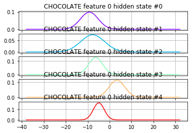
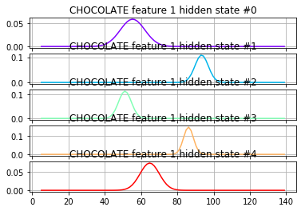
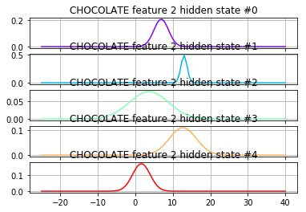
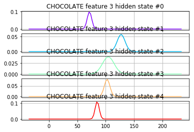

# Artificial Intelligence Engineer Nanodegree - Probabilistic Models
## Project: Sign Language Recognition System
- [Introduction](#intro)
- [Part 1 Feature Selection](#part1_tutorial)
    - [Tutorial](#part1_tutorial)
    - [Features Submission](#part1_submission)
    - [Features Unittest](#part1_test)
- [Part 2 Train the models](#part2_tutorial)
    - [Tutorial](#part2_tutorial)
    - [Model Selection Score Submission](#part2_submission)
    - [Model Score Unittest](#part2_test)
- [Part 3 Build a Recognizer](#part3_tutorial)
    - [Tutorial](#part3_tutorial)
    - [Recognizer Submission](#part3_submission)
    - [Recognizer Unittest](#part3_test)
- [Part 4 (OPTIONAL) Improve the WER with Language Models](#part4_info)

<a id='intro'></a>
## Introduction
The overall goal of this project is to build a word recognizer for American Sign Language video sequences, demonstrating the power of probabalistic models.  In particular, this project employs  [hidden Markov models (HMM's)](https://en.wikipedia.org/wiki/Hidden_Markov_model) to analyze a series of measurements taken from videos of American Sign Language (ASL) collected for research (see the [RWTH-BOSTON-104 Database](http://www-i6.informatik.rwth-aachen.de/~dreuw/database-rwth-boston-104.php)).  In this video, the right-hand x and y locations are plotted as the speaker signs the sentence.
[](https://drive.google.com/open?id=0B_5qGuFe-wbhUXRuVnNZVnMtam8)

The raw data, train, and test sets are pre-defined.  You will derive a variety of feature sets (explored in Part 1), as well as implement three different model selection criterion to determine the optimal number of hidden states for each word model (explored in Part 2). Finally, in Part 3 you will implement the recognizer and compare the effects the different combinations of feature sets and model selection criteria.  

At the end of each Part, complete the submission cells with implementations, answer all questions, and pass the unit tests.  Then submit the completed notebook for review!

<a id='part1_tutorial'></a>
## PART 1: Data

### Features Tutorial
##### Load the initial database
A data handler designed for this database is provided in the student codebase as the `AslDb` class in the `asl_data` module.  This handler creates the initial [pandas](http://pandas.pydata.org/pandas-docs/stable/) dataframe from the corpus of data included in the `data` directory as well as dictionaries suitable for extracting data in a format friendly to the [hmmlearn](https://hmmlearn.readthedocs.io/en/latest/) library.  We'll use those to create models in Part 2.

To start, let's set up the initial database and select an example set of features for the training set.  At the end of Part 1, you will create additional feature sets for experimentation. 


```python
import numpy as np
import pandas as pd
from asl_data import AslDb


asl = AslDb() # initializes the database
asl.df.head() # displays the first five rows of the asl database, indexed by video and frame
```


<div>
<table border="1" class="dataframe">
  <thead>
    <tr style="text-align: right;">
      <th></th>
      <th></th>
      <th>left-x</th>
      <th>left-y</th>
      <th>right-x</th>
      <th>right-y</th>
      <th>nose-x</th>
      <th>nose-y</th>
      <th>speaker</th>
    </tr>
    <tr>
      <th>video</th>
      <th>frame</th>
      <th></th>
      <th></th>
      <th></th>
      <th></th>
      <th></th>
      <th></th>
      <th></th>
    </tr>
  </thead>
  <tbody>
    <tr>
      <th rowspan="5" valign="top">98</th>
      <th>0</th>
      <td>149</td>
      <td>181</td>
      <td>170</td>
      <td>175</td>
      <td>161</td>
      <td>62</td>
      <td>woman-1</td>
    </tr>
    <tr>
      <th>1</th>
      <td>149</td>
      <td>181</td>
      <td>170</td>
      <td>175</td>
      <td>161</td>
      <td>62</td>
      <td>woman-1</td>
    </tr>
    <tr>
      <th>2</th>
      <td>149</td>
      <td>181</td>
      <td>170</td>
      <td>175</td>
      <td>161</td>
      <td>62</td>
      <td>woman-1</td>
    </tr>
    <tr>
      <th>3</th>
      <td>149</td>
      <td>181</td>
      <td>170</td>
      <td>175</td>
      <td>161</td>
      <td>62</td>
      <td>woman-1</td>
    </tr>
    <tr>
      <th>4</th>
      <td>149</td>
      <td>181</td>
      <td>170</td>
      <td>175</td>
      <td>161</td>
      <td>62</td>
      <td>woman-1</td>
    </tr>
  </tbody>
</table>
</div>


```python
asl.df.ix[98,1]  # look at the data available for an individual frame
```


    left-x         149
    left-y         181
    right-x        170
    right-y        175
    nose-x         161
    nose-y          62
    speaker    woman-1
    Name: (98, 1), dtype: object


The frame represented by video 98, frame 1 is shown here:


##### Feature selection for training the model
The objective of feature selection when training a model is to choose the most relevant variables while keeping the model as simple as possible, thus reducing training time.  We can use the raw features already provided or derive our own and add columns to the pandas dataframe `asl.df` for selection. As an example, in the next cell a feature named `'grnd-ry'` is added. This feature is the difference between the right-hand y value and the nose y value, which serves as the "ground" right y value. 


```python
asl.df['grnd-ry'] = asl.df['right-y'] - asl.df['nose-y']
asl.df.head()  # the new feature 'grnd-ry' is now in the frames dictionary
```


<div>
<table border="1" class="dataframe">
  <thead>
    <tr style="text-align: right;">
      <th></th>
      <th></th>
      <th>left-x</th>
      <th>left-y</th>
      <th>right-x</th>
      <th>right-y</th>
      <th>nose-x</th>
      <th>nose-y</th>
      <th>speaker</th>
      <th>grnd-ry</th>
    </tr>
    <tr>
      <th>video</th>
      <th>frame</th>
      <th></th>
      <th></th>
      <th></th>
      <th></th>
      <th></th>
      <th></th>
      <th></th>
      <th></th>
    </tr>
  </thead>
  <tbody>
    <tr>
      <th rowspan="5" valign="top">98</th>
      <th>0</th>
      <td>149</td>
      <td>181</td>
      <td>170</td>
      <td>175</td>
      <td>161</td>
      <td>62</td>
      <td>woman-1</td>
      <td>113</td>
    </tr>
    <tr>
      <th>1</th>
      <td>149</td>
      <td>181</td>
      <td>170</td>
      <td>175</td>
      <td>161</td>
      <td>62</td>
      <td>woman-1</td>
      <td>113</td>
    </tr>
    <tr>
      <th>2</th>
      <td>149</td>
      <td>181</td>
      <td>170</td>
      <td>175</td>
      <td>161</td>
      <td>62</td>
      <td>woman-1</td>
      <td>113</td>
    </tr>
    <tr>
      <th>3</th>
      <td>149</td>
      <td>181</td>
      <td>170</td>
      <td>175</td>
      <td>161</td>
      <td>62</td>
      <td>woman-1</td>
      <td>113</td>
    </tr>
    <tr>
      <th>4</th>
      <td>149</td>
      <td>181</td>
      <td>170</td>
      <td>175</td>
      <td>161</td>
      <td>62</td>
      <td>woman-1</td>
      <td>113</td>
    </tr>
  </tbody>
</table>
</div>


##### Try it!


```python
from asl_utils import test_features_tryit
# TODO add df columns for 'grnd-rx', 'grnd-ly', 'grnd-lx' representing differences between hand and nose locations

asl.df['grnd-rx'] = asl.df['right-x'] - asl.df['nose-x']
asl.df['grnd-ly'] = asl.df['left-y'] - asl.df['nose-y']
asl.df['grnd-lx'] = asl.df['left-x'] - asl.df['nose-x']

# test the code
test_features_tryit(asl)
```

    asl.df sample


<div>
<table border="1" class="dataframe">
  <thead>
    <tr style="text-align: right;">
      <th></th>
      <th></th>
      <th>left-x</th>
      <th>left-y</th>
      <th>right-x</th>
      <th>right-y</th>
      <th>nose-x</th>
      <th>nose-y</th>
      <th>speaker</th>
      <th>grnd-ry</th>
      <th>grnd-rx</th>
      <th>grnd-ly</th>
      <th>grnd-lx</th>
    </tr>
    <tr>
      <th>video</th>
      <th>frame</th>
      <th></th>
      <th></th>
      <th></th>
      <th></th>
      <th></th>
      <th></th>
      <th></th>
      <th></th>
      <th></th>
      <th></th>
      <th></th>
    </tr>
  </thead>
  <tbody>
    <tr>
      <th rowspan="5" valign="top">98</th>
      <th>0</th>
      <td>149</td>
      <td>181</td>
      <td>170</td>
      <td>175</td>
      <td>161</td>
      <td>62</td>
      <td>woman-1</td>
      <td>113</td>
      <td>9</td>
      <td>119</td>
      <td>-12</td>
    </tr>
    <tr>
      <th>1</th>
      <td>149</td>
      <td>181</td>
      <td>170</td>
      <td>175</td>
      <td>161</td>
      <td>62</td>
      <td>woman-1</td>
      <td>113</td>
      <td>9</td>
      <td>119</td>
      <td>-12</td>
    </tr>
    <tr>
      <th>2</th>
      <td>149</td>
      <td>181</td>
      <td>170</td>
      <td>175</td>
      <td>161</td>
      <td>62</td>
      <td>woman-1</td>
      <td>113</td>
      <td>9</td>
      <td>119</td>
      <td>-12</td>
    </tr>
    <tr>
      <th>3</th>
      <td>149</td>
      <td>181</td>
      <td>170</td>
      <td>175</td>
      <td>161</td>
      <td>62</td>
      <td>woman-1</td>
      <td>113</td>
      <td>9</td>
      <td>119</td>
      <td>-12</td>
    </tr>
    <tr>
      <th>4</th>
      <td>149</td>
      <td>181</td>
      <td>170</td>
      <td>175</td>
      <td>161</td>
      <td>62</td>
      <td>woman-1</td>
      <td>113</td>
      <td>9</td>
      <td>119</td>
      <td>-12</td>
    </tr>
  </tbody>
</table>
</div>


<font color=green>Correct!</font><br/>


```python
# collect the features into a list
features_ground = ['grnd-rx','grnd-ry','grnd-lx','grnd-ly']
 #show a single set of features for a given (video, frame) tuple
[asl.df.ix[98,1][v] for v in features_ground]
```


    [9, 113, -12, 119]


##### Build the training set
Now that we have a feature list defined, we can pass that list to the `build_training` method to collect the features for all the words in the training set.  Each word in the training set has multiple examples from various videos.  Below we can see the unique words that have been loaded into the training set:


```python
training = asl.build_training(features_ground)
print("Training words: {}".format(training.words))
```

    Training words: ['JOHN', 'WRITE', 'HOMEWORK', 'IX-1P', 'SEE', 'YESTERDAY', 'IX', 'LOVE', 'MARY', 'CAN', 'GO', 'GO1', 'FUTURE', 'GO2', 'PARTY', 'FUTURE1', 'HIT', 'BLAME', 'FRED', 'FISH', 'WONT', 'EAT', 'BUT', 'CHICKEN', 'VEGETABLE', 'CHINA', 'PEOPLE', 'PREFER', 'BROCCOLI', 'LIKE', 'LEAVE', 'SAY', 'BUY', 'HOUSE', 'KNOW', 'CORN', 'CORN1', 'THINK', 'NOT', 'PAST', 'LIVE', 'CHICAGO', 'CAR', 'SHOULD', 'DECIDE', 'VISIT', 'MOVIE', 'WANT', 'SELL', 'TOMORROW', 'NEXT-WEEK', 'NEW-YORK', 'LAST-WEEK', 'WILL', 'FINISH', 'ANN', 'READ', 'BOOK', 'CHOCOLATE', 'FIND', 'SOMETHING-ONE', 'POSS', 'BROTHER', 'ARRIVE', 'HERE', 'GIVE', 'MAN', 'NEW', 'COAT', 'WOMAN', 'GIVE1', 'HAVE', 'FRANK', 'BREAK-DOWN', 'SEARCH-FOR', 'WHO', 'WHAT', 'LEG', 'FRIEND', 'CANDY', 'BLUE', 'SUE', 'BUY1', 'STOLEN', 'OLD', 'STUDENT', 'VIDEOTAPE', 'BORROW', 'MOTHER', 'POTATO', 'TELL', 'BILL', 'THROW', 'APPLE', 'NAME', 'SHOOT', 'SAY-1P', 'SELF', 'GROUP', 'JANA', 'TOY1', 'MANY', 'TOY', 'ALL', 'BOY', 'TEACHER', 'GIRL', 'BOX', 'GIVE2', 'GIVE3', 'GET', 'PUTASIDE']


The training data in `training` is an object of class `WordsData` defined in the `asl_data` module.  in addition to the `words` list, data can be accessed with the `get_all_sequences`, `get_all_Xlengths`, `get_word_sequences`, and `get_word_Xlengths` methods. We need the `get_word_Xlengths` method to train multiple sequences with the `hmmlearn` library.  In the following example, notice that there are two lists; the first is a concatenation of all the sequences(the X portion) and the second is a list of the sequence lengths(the Lengths portion).


```python
training.get_word_Xlengths('CHOCOLATE')
```


    (array([[-11,  48,   7, 120],
            [-11,  48,   8, 109],
            [ -8,  49,  11,  98],
            [ -7,  50,   7,  87],
            [ -4,  54,   7,  77],
            [ -4,  54,   6,  69],
            [ -4,  54,   6,  69],
            [-13,  52,   6,  69],
            [-13,  52,   6,  69],
            [ -8,  51,   6,  69],
            [ -8,  51,   6,  69],
            [ -8,  51,   6,  69],
            [ -8,  51,   6,  69],
            [ -8,  51,   6,  69],
            [-10,  59,   7,  71],
            [-15,  64,   9,  77],
            [-17,  75,  13,  81],
            [ -4,  48,  -4, 113],
            [ -2,  53,  -4, 113],
            [ -4,  55,   2,  98],
            [ -4,  58,   2,  98],
            [ -1,  59,   2,  89],
            [ -1,  59,  -1,  84],
            [ -1,  59,  -1,  84],
            [ -7,  63,  -1,  84],
            [ -7,  63,  -1,  84],
            [ -7,  63,   3,  83],
            [ -7,  63,   3,  83],
            [ -7,  63,   3,  83],
            [ -7,  63,   3,  83],
            [ -7,  63,   3,  83],
            [ -7,  63,   3,  83],
            [ -7,  63,   3,  83],
            [ -4,  70,   3,  83],
            [ -4,  70,   3,  83],
            [ -2,  73,   5,  90],
            [ -3,  79,  -4,  96],
            [-15,  98,  13, 135],
            [ -6,  93,  12, 128],
            [ -2,  89,  14, 118],
            [  5,  90,  10, 108],
            [  4,  86,   7, 105],
            [  4,  86,   7, 105],
            [  4,  86,  13, 100],
            [ -3,  82,  14,  96],
            [ -3,  82,  14,  96],
            [  6,  89,  16, 100],
            [  6,  89,  16, 100],
            [  7,  85,  17, 111]]), [17, 20, 12])


###### More feature sets
So far we have a simple feature set that is enough to get started modeling.  However, we might get better results if we manipulate the raw values a bit more, so we will go ahead and set up some other options now for experimentation later.  For example, we could normalize each speaker's range of motion with grouped statistics using [Pandas stats](http://pandas.pydata.org/pandas-docs/stable/api.html#api-dataframe-stats) functions and [pandas groupby](http://pandas.pydata.org/pandas-docs/stable/generated/pandas.DataFrame.groupby.html).  Below is an example for finding the means of all speaker subgroups.


```python
df_means = asl.df.groupby('speaker').mean()
df_means
```


<div>
<table border="1" class="dataframe">
  <thead>
    <tr style="text-align: right;">
      <th></th>
      <th>left-x</th>
      <th>left-y</th>
      <th>right-x</th>
      <th>right-y</th>
      <th>nose-x</th>
      <th>nose-y</th>
      <th>grnd-ry</th>
      <th>grnd-rx</th>
      <th>grnd-ly</th>
      <th>grnd-lx</th>
    </tr>
    <tr>
      <th>speaker</th>
      <th></th>
      <th></th>
      <th></th>
      <th></th>
      <th></th>
      <th></th>
      <th></th>
      <th></th>
      <th></th>
      <th></th>
    </tr>
  </thead>
  <tbody>
    <tr>
      <th>man-1</th>
      <td>206.248203</td>
      <td>218.679449</td>
      <td>155.464350</td>
      <td>150.371031</td>
      <td>175.031756</td>
      <td>61.642600</td>
      <td>88.728430</td>
      <td>-19.567406</td>
      <td>157.036848</td>
      <td>31.216447</td>
    </tr>
    <tr>
      <th>woman-1</th>
      <td>164.661438</td>
      <td>161.271242</td>
      <td>151.017865</td>
      <td>117.332462</td>
      <td>162.655120</td>
      <td>57.245098</td>
      <td>60.087364</td>
      <td>-11.637255</td>
      <td>104.026144</td>
      <td>2.006318</td>
    </tr>
    <tr>
      <th>woman-2</th>
      <td>183.214509</td>
      <td>176.527232</td>
      <td>156.866295</td>
      <td>119.835714</td>
      <td>170.318973</td>
      <td>58.022098</td>
      <td>61.813616</td>
      <td>-13.452679</td>
      <td>118.505134</td>
      <td>12.895536</td>
    </tr>
  </tbody>
</table>
</div>


To select a mean that matches by speaker, use the pandas [map](http://pandas.pydata.org/pandas-docs/stable/generated/pandas.Series.map.html) method:


```python
asl.df['left-x-mean']= asl.df['speaker'].map(df_means['left-x'])
asl.df.head()
```


<div>
<table border="1" class="dataframe">
  <thead>
    <tr style="text-align: right;">
      <th></th>
      <th></th>
      <th>left-x</th>
      <th>left-y</th>
      <th>right-x</th>
      <th>right-y</th>
      <th>nose-x</th>
      <th>nose-y</th>
      <th>speaker</th>
      <th>grnd-ry</th>
      <th>grnd-rx</th>
      <th>grnd-ly</th>
      <th>grnd-lx</th>
      <th>left-x-mean</th>
    </tr>
    <tr>
      <th>video</th>
      <th>frame</th>
      <th></th>
      <th></th>
      <th></th>
      <th></th>
      <th></th>
      <th></th>
      <th></th>
      <th></th>
      <th></th>
      <th></th>
      <th></th>
      <th></th>
    </tr>
  </thead>
  <tbody>
    <tr>
      <th rowspan="5" valign="top">98</th>
      <th>0</th>
      <td>149</td>
      <td>181</td>
      <td>170</td>
      <td>175</td>
      <td>161</td>
      <td>62</td>
      <td>woman-1</td>
      <td>113</td>
      <td>9</td>
      <td>119</td>
      <td>-12</td>
      <td>164.661438</td>
    </tr>
    <tr>
      <th>1</th>
      <td>149</td>
      <td>181</td>
      <td>170</td>
      <td>175</td>
      <td>161</td>
      <td>62</td>
      <td>woman-1</td>
      <td>113</td>
      <td>9</td>
      <td>119</td>
      <td>-12</td>
      <td>164.661438</td>
    </tr>
    <tr>
      <th>2</th>
      <td>149</td>
      <td>181</td>
      <td>170</td>
      <td>175</td>
      <td>161</td>
      <td>62</td>
      <td>woman-1</td>
      <td>113</td>
      <td>9</td>
      <td>119</td>
      <td>-12</td>
      <td>164.661438</td>
    </tr>
    <tr>
      <th>3</th>
      <td>149</td>
      <td>181</td>
      <td>170</td>
      <td>175</td>
      <td>161</td>
      <td>62</td>
      <td>woman-1</td>
      <td>113</td>
      <td>9</td>
      <td>119</td>
      <td>-12</td>
      <td>164.661438</td>
    </tr>
    <tr>
      <th>4</th>
      <td>149</td>
      <td>181</td>
      <td>170</td>
      <td>175</td>
      <td>161</td>
      <td>62</td>
      <td>woman-1</td>
      <td>113</td>
      <td>9</td>
      <td>119</td>
      <td>-12</td>
      <td>164.661438</td>
    </tr>
  </tbody>
</table>
</div>


##### Try it!


```python
from asl_utils import test_std_tryit
# TODO Create a dataframe named `df_std` with standard deviations grouped by speaker

df_std = asl.df.groupby('speaker').std()


# test the code
test_std_tryit(df_std)
```

    df_std


<div>
<table border="1" class="dataframe">
  <thead>
    <tr style="text-align: right;">
      <th></th>
      <th>left-x</th>
      <th>left-y</th>
      <th>right-x</th>
      <th>right-y</th>
      <th>nose-x</th>
      <th>nose-y</th>
      <th>grnd-ry</th>
      <th>grnd-rx</th>
      <th>grnd-ly</th>
      <th>grnd-lx</th>
      <th>left-x-mean</th>
    </tr>
    <tr>
      <th>speaker</th>
      <th></th>
      <th></th>
      <th></th>
      <th></th>
      <th></th>
      <th></th>
      <th></th>
      <th></th>
      <th></th>
      <th></th>
      <th></th>
    </tr>
  </thead>
  <tbody>
    <tr>
      <th>man-1</th>
      <td>15.154425</td>
      <td>36.328485</td>
      <td>18.901917</td>
      <td>54.902340</td>
      <td>6.654573</td>
      <td>5.520045</td>
      <td>53.487999</td>
      <td>20.269032</td>
      <td>36.572749</td>
      <td>15.080360</td>
      <td>0.0</td>
    </tr>
    <tr>
      <th>woman-1</th>
      <td>17.573442</td>
      <td>26.594521</td>
      <td>16.459943</td>
      <td>34.667787</td>
      <td>3.549392</td>
      <td>3.538330</td>
      <td>33.972660</td>
      <td>16.764706</td>
      <td>27.117393</td>
      <td>17.328941</td>
      <td>0.0</td>
    </tr>
    <tr>
      <th>woman-2</th>
      <td>15.388711</td>
      <td>28.825025</td>
      <td>14.890288</td>
      <td>39.649111</td>
      <td>4.099760</td>
      <td>3.416167</td>
      <td>39.128572</td>
      <td>16.191324</td>
      <td>29.320655</td>
      <td>15.050938</td>
      <td>0.0</td>
    </tr>
  </tbody>
</table>
</div>


<font color=green>Correct!</font><br/>


<a id='part1_submission'></a>
### Features Implementation Submission
Implement four feature sets and answer the question that follows.
- normalized Cartesian coordinates
    - use *mean* and *standard deviation* statistics and the [standard score](https://en.wikipedia.org/wiki/Standard_score) equation to account for speakers with different heights and arm length
    
- polar coordinates
    - calculate polar coordinates with [Cartesian to polar equations](https://en.wikipedia.org/wiki/Polar_coordinate_system#Converting_between_polar_and_Cartesian_coordinates)
    - use the [np.arctan2](https://docs.scipy.org/doc/numpy-1.10.0/reference/generated/numpy.arctan2.html) function and *swap the x and y axes* to move the $0$ to $2\pi$ discontinuity to 12 o'clock instead of 3 o'clock;  in other words, the normal break in radians value from $0$ to $2\pi$ occurs directly to the left of the speaker's nose, which may be in the signing area and interfere with results.  By swapping the x and y axes, that discontinuity move to directly above the speaker's head, an area not generally used in signing.

- delta difference
    - as described in Thad's lecture, use the difference in values between one frame and the next frames as features
    - pandas [diff method](http://pandas.pydata.org/pandas-docs/stable/generated/pandas.DataFrame.diff.html) and [fillna method](http://pandas.pydata.org/pandas-docs/stable/generated/pandas.DataFrame.fillna.html) will be helpful for this one

- custom features
    - These are your own design; combine techniques used above or come up with something else entirely. We look forward to seeing what you come up with! 
    Some ideas to get you started:
        - normalize using a [feature scaling equation](https://en.wikipedia.org/wiki/Feature_scaling)
        - normalize the polar coordinates
        - adding additional deltas


#### Normalized Cartesian Coordinates


```python
# TODO add features for normalized by speaker values of left, right, x, y
# Name these 'norm-rx', 'norm-ry', 'norm-lx', and 'norm-ly'
# using Z-score scaling (X-Xmean)/Xstd
```


```python
## add remaining mean features to dataset

asl.df['left-y-mean'] = asl.df['speaker'].map(df_means['left-y'])
asl.df['right-x-mean'] = asl.df['speaker'].map(df_means['right-x'])
asl.df['right-y-mean'] = asl.df['speaker'].map(df_means['right-y'])

asl.df.head()
```


<div>
<table border="1" class="dataframe">
  <thead>
    <tr style="text-align: right;">
      <th></th>
      <th></th>
      <th>left-x</th>
      <th>left-y</th>
      <th>right-x</th>
      <th>right-y</th>
      <th>nose-x</th>
      <th>nose-y</th>
      <th>speaker</th>
      <th>grnd-ry</th>
      <th>grnd-rx</th>
      <th>grnd-ly</th>
      <th>grnd-lx</th>
      <th>left-x-mean</th>
      <th>left-y-mean</th>
      <th>right-x-mean</th>
      <th>right-y-mean</th>
    </tr>
    <tr>
      <th>video</th>
      <th>frame</th>
      <th></th>
      <th></th>
      <th></th>
      <th></th>
      <th></th>
      <th></th>
      <th></th>
      <th></th>
      <th></th>
      <th></th>
      <th></th>
      <th></th>
      <th></th>
      <th></th>
      <th></th>
    </tr>
  </thead>
  <tbody>
    <tr>
      <th rowspan="5" valign="top">98</th>
      <th>0</th>
      <td>149</td>
      <td>181</td>
      <td>170</td>
      <td>175</td>
      <td>161</td>
      <td>62</td>
      <td>woman-1</td>
      <td>113</td>
      <td>9</td>
      <td>119</td>
      <td>-12</td>
      <td>164.661438</td>
      <td>161.271242</td>
      <td>151.017865</td>
      <td>117.332462</td>
    </tr>
    <tr>
      <th>1</th>
      <td>149</td>
      <td>181</td>
      <td>170</td>
      <td>175</td>
      <td>161</td>
      <td>62</td>
      <td>woman-1</td>
      <td>113</td>
      <td>9</td>
      <td>119</td>
      <td>-12</td>
      <td>164.661438</td>
      <td>161.271242</td>
      <td>151.017865</td>
      <td>117.332462</td>
    </tr>
    <tr>
      <th>2</th>
      <td>149</td>
      <td>181</td>
      <td>170</td>
      <td>175</td>
      <td>161</td>
      <td>62</td>
      <td>woman-1</td>
      <td>113</td>
      <td>9</td>
      <td>119</td>
      <td>-12</td>
      <td>164.661438</td>
      <td>161.271242</td>
      <td>151.017865</td>
      <td>117.332462</td>
    </tr>
    <tr>
      <th>3</th>
      <td>149</td>
      <td>181</td>
      <td>170</td>
      <td>175</td>
      <td>161</td>
      <td>62</td>
      <td>woman-1</td>
      <td>113</td>
      <td>9</td>
      <td>119</td>
      <td>-12</td>
      <td>164.661438</td>
      <td>161.271242</td>
      <td>151.017865</td>
      <td>117.332462</td>
    </tr>
    <tr>
      <th>4</th>
      <td>149</td>
      <td>181</td>
      <td>170</td>
      <td>175</td>
      <td>161</td>
      <td>62</td>
      <td>woman-1</td>
      <td>113</td>
      <td>9</td>
      <td>119</td>
      <td>-12</td>
      <td>164.661438</td>
      <td>161.271242</td>
      <td>151.017865</td>
      <td>117.332462</td>
    </tr>
  </tbody>
</table>
</div>


```python
## add standard deviation features to dataset

asl.df['left-x-std'] = asl.df['speaker'].map(df_std['left-x'])
asl.df['left-y-std'] = asl.df['speaker'].map(df_std['left-y'])
asl.df['right-x-std'] = asl.df['speaker'].map(df_std['right-x'])
asl.df['right-y-std'] = asl.df['speaker'].map(df_std['right-y'])

asl.df.head()
```


<div>
<table border="1" class="dataframe">
  <thead>
    <tr style="text-align: right;">
      <th></th>
      <th></th>
      <th>left-x</th>
      <th>left-y</th>
      <th>right-x</th>
      <th>right-y</th>
      <th>nose-x</th>
      <th>nose-y</th>
      <th>speaker</th>
      <th>grnd-ry</th>
      <th>grnd-rx</th>
      <th>grnd-ly</th>
      <th>grnd-lx</th>
      <th>left-x-mean</th>
      <th>left-y-mean</th>
      <th>right-x-mean</th>
      <th>right-y-mean</th>
      <th>left-x-std</th>
      <th>left-y-std</th>
      <th>right-x-std</th>
      <th>right-y-std</th>
    </tr>
    <tr>
      <th>video</th>
      <th>frame</th>
      <th></th>
      <th></th>
      <th></th>
      <th></th>
      <th></th>
      <th></th>
      <th></th>
      <th></th>
      <th></th>
      <th></th>
      <th></th>
      <th></th>
      <th></th>
      <th></th>
      <th></th>
      <th></th>
      <th></th>
      <th></th>
      <th></th>
    </tr>
  </thead>
  <tbody>
    <tr>
      <th rowspan="5" valign="top">98</th>
      <th>0</th>
      <td>149</td>
      <td>181</td>
      <td>170</td>
      <td>175</td>
      <td>161</td>
      <td>62</td>
      <td>woman-1</td>
      <td>113</td>
      <td>9</td>
      <td>119</td>
      <td>-12</td>
      <td>164.661438</td>
      <td>161.271242</td>
      <td>151.017865</td>
      <td>117.332462</td>
      <td>17.573442</td>
      <td>26.594521</td>
      <td>16.459943</td>
      <td>34.667787</td>
    </tr>
    <tr>
      <th>1</th>
      <td>149</td>
      <td>181</td>
      <td>170</td>
      <td>175</td>
      <td>161</td>
      <td>62</td>
      <td>woman-1</td>
      <td>113</td>
      <td>9</td>
      <td>119</td>
      <td>-12</td>
      <td>164.661438</td>
      <td>161.271242</td>
      <td>151.017865</td>
      <td>117.332462</td>
      <td>17.573442</td>
      <td>26.594521</td>
      <td>16.459943</td>
      <td>34.667787</td>
    </tr>
    <tr>
      <th>2</th>
      <td>149</td>
      <td>181</td>
      <td>170</td>
      <td>175</td>
      <td>161</td>
      <td>62</td>
      <td>woman-1</td>
      <td>113</td>
      <td>9</td>
      <td>119</td>
      <td>-12</td>
      <td>164.661438</td>
      <td>161.271242</td>
      <td>151.017865</td>
      <td>117.332462</td>
      <td>17.573442</td>
      <td>26.594521</td>
      <td>16.459943</td>
      <td>34.667787</td>
    </tr>
    <tr>
      <th>3</th>
      <td>149</td>
      <td>181</td>
      <td>170</td>
      <td>175</td>
      <td>161</td>
      <td>62</td>
      <td>woman-1</td>
      <td>113</td>
      <td>9</td>
      <td>119</td>
      <td>-12</td>
      <td>164.661438</td>
      <td>161.271242</td>
      <td>151.017865</td>
      <td>117.332462</td>
      <td>17.573442</td>
      <td>26.594521</td>
      <td>16.459943</td>
      <td>34.667787</td>
    </tr>
    <tr>
      <th>4</th>
      <td>149</td>
      <td>181</td>
      <td>170</td>
      <td>175</td>
      <td>161</td>
      <td>62</td>
      <td>woman-1</td>
      <td>113</td>
      <td>9</td>
      <td>119</td>
      <td>-12</td>
      <td>164.661438</td>
      <td>161.271242</td>
      <td>151.017865</td>
      <td>117.332462</td>
      <td>17.573442</td>
      <td>26.594521</td>
      <td>16.459943</td>
      <td>34.667787</td>
    </tr>
  </tbody>
</table>
</div>


```python
## Normalized features

asl.df['norm-rx']= (asl.df['right-x'] - asl.df['right-x-mean']) / asl.df['right-x-std']
asl.df['norm-ry']= (asl.df['right-y'] - asl.df['right-y-mean']) / asl.df['right-y-std']
asl.df['norm-lx']= (asl.df['left-x'] - asl.df['left-x-mean']) / asl.df['left-x-std']
asl.df['norm-ly']= (asl.df['left-y'] - asl.df['left-y-mean']) / asl.df['left-y-std']


features_norm = ['norm-rx', 'norm-ry', 'norm-lx','norm-ly']
```

#### Polar Coordinates


```python
# TODO add features for polar coordinate values where the nose is the origin
# Name these 'polar-rr', 'polar-rtheta', 'polar-lr', and 'polar-ltheta'
# Note that 'polar-rr' and 'polar-rtheta' refer to the radius and angle
```


```python
asl.df['polar-rr'] = np.sqrt(np.square(asl.df['grnd-rx']) + np.square(asl.df['grnd-ry']))
asl.df['polar-lr'] = np.sqrt(np.square(asl.df['grnd-lx']) + np.square(asl.df['grnd-ly']))

asl.df['polar-rtheta'] = np.arctan2(asl.df['grnd-rx'], asl.df['grnd-ry'])
asl.df['polar-ltheta'] = np.arctan2(asl.df['grnd-lx'], asl.df['grnd-ly'])

asl.df['polar-rtheta'] = asl.df['polar-rtheta'].fillna(0)
asl.df['polar-ltheta'] = asl.df['polar-ltheta'].fillna(0)

features_polar = ['polar-rr', 'polar-rtheta', 'polar-lr', 'polar-ltheta']
```

#### Delta Difference


```python
# TODO add features for left, right, x, y differences by one time step, i.e. the "delta" values discussed in the lecture
# Name these 'delta-rx', 'delta-ry', 'delta-lx', and 'delta-ly'
```


```python
asl.df['delta-rx'] = asl.df['right-x'].diff()
asl.df['delta-ry'] = asl.df['right-y'].diff()
asl.df['delta-lx'] = asl.df['left-x'].diff()
asl.df['delta-ly'] = asl.df['left-y'].diff()

asl.df['delta-rx'] = asl.df['delta-rx'].fillna(0)
asl.df['delta-ry'] = asl.df['delta-ry'].fillna(0)
asl.df['delta-lx'] = asl.df['delta-lx'].fillna(0)
asl.df['delta-ly'] = asl.df['delta-ly'].fillna(0)

features_delta = ['delta-rx', 'delta-ry', 'delta-lx', 'delta-ly']
```

#### Verify Features


```python
from random import randint

rand = randint(0, len(asl.df)-10)
asl.df[rand:(rand+10)]
```


<div>
<table border="1" class="dataframe">
  <thead>
    <tr style="text-align: right;">
      <th></th>
      <th></th>
      <th>left-x</th>
      <th>left-y</th>
      <th>right-x</th>
      <th>right-y</th>
      <th>nose-x</th>
      <th>nose-y</th>
      <th>speaker</th>
      <th>grnd-ry</th>
      <th>grnd-rx</th>
      <th>grnd-ly</th>
      <th>...</th>
      <th>norm-lx</th>
      <th>norm-ly</th>
      <th>polar-rr</th>
      <th>polar-lr</th>
      <th>polar-rtheta</th>
      <th>polar-ltheta</th>
      <th>delta-rx</th>
      <th>delta-ry</th>
      <th>delta-lx</th>
      <th>delta-ly</th>
    </tr>
    <tr>
      <th>video</th>
      <th>frame</th>
      <th></th>
      <th></th>
      <th></th>
      <th></th>
      <th></th>
      <th></th>
      <th></th>
      <th></th>
      <th></th>
      <th></th>
      <th></th>
      <th></th>
      <th></th>
      <th></th>
      <th></th>
      <th></th>
      <th></th>
      <th></th>
      <th></th>
      <th></th>
      <th></th>
    </tr>
  </thead>
  <tbody>
    <tr>
      <th rowspan="10" valign="top">117</th>
      <th>33</th>
      <td>199</td>
      <td>207</td>
      <td>161</td>
      <td>118</td>
      <td>174</td>
      <td>62</td>
      <td>man-1</td>
      <td>56</td>
      <td>-13</td>
      <td>145</td>
      <td>...</td>
      <td>-0.478290</td>
      <td>-0.321496</td>
      <td>57.489129</td>
      <td>147.139390</td>
      <td>-0.228103</td>
      <td>0.170735</td>
      <td>-5.0</td>
      <td>-8.0</td>
      <td>6.0</td>
      <td>14.0</td>
    </tr>
    <tr>
      <th>34</th>
      <td>198</td>
      <td>222</td>
      <td>157</td>
      <td>115</td>
      <td>173</td>
      <td>63</td>
      <td>man-1</td>
      <td>52</td>
      <td>-16</td>
      <td>159</td>
      <td>...</td>
      <td>-0.544277</td>
      <td>0.091404</td>
      <td>54.405882</td>
      <td>160.953409</td>
      <td>-0.298499</td>
      <td>0.155956</td>
      <td>-4.0</td>
      <td>-3.0</td>
      <td>-1.0</td>
      <td>15.0</td>
    </tr>
    <tr>
      <th>35</th>
      <td>203</td>
      <td>236</td>
      <td>147</td>
      <td>112</td>
      <td>172</td>
      <td>61</td>
      <td>man-1</td>
      <td>51</td>
      <td>-25</td>
      <td>175</td>
      <td>...</td>
      <td>-0.214340</td>
      <td>0.476776</td>
      <td>56.797887</td>
      <td>177.724506</td>
      <td>-0.455774</td>
      <td>0.175324</td>
      <td>-10.0</td>
      <td>-3.0</td>
      <td>5.0</td>
      <td>14.0</td>
    </tr>
    <tr>
      <th>36</th>
      <td>215</td>
      <td>238</td>
      <td>139</td>
      <td>109</td>
      <td>173</td>
      <td>68</td>
      <td>man-1</td>
      <td>41</td>
      <td>-34</td>
      <td>170</td>
      <td>...</td>
      <td>0.577508</td>
      <td>0.531829</td>
      <td>53.263496</td>
      <td>175.111393</td>
      <td>-0.692334</td>
      <td>0.242209</td>
      <td>-8.0</td>
      <td>-3.0</td>
      <td>12.0</td>
      <td>2.0</td>
    </tr>
    <tr>
      <th>37</th>
      <td>215</td>
      <td>238</td>
      <td>131</td>
      <td>111</td>
      <td>173</td>
      <td>68</td>
      <td>man-1</td>
      <td>43</td>
      <td>-42</td>
      <td>170</td>
      <td>...</td>
      <td>0.577508</td>
      <td>0.531829</td>
      <td>60.108236</td>
      <td>175.111393</td>
      <td>-0.773634</td>
      <td>0.242209</td>
      <td>-8.0</td>
      <td>2.0</td>
      <td>0.0</td>
      <td>0.0</td>
    </tr>
    <tr>
      <th>38</th>
      <td>215</td>
      <td>238</td>
      <td>123</td>
      <td>114</td>
      <td>173</td>
      <td>68</td>
      <td>man-1</td>
      <td>46</td>
      <td>-50</td>
      <td>170</td>
      <td>...</td>
      <td>0.577508</td>
      <td>0.531829</td>
      <td>67.941151</td>
      <td>175.111393</td>
      <td>-0.827041</td>
      <td>0.242209</td>
      <td>-8.0</td>
      <td>3.0</td>
      <td>0.0</td>
      <td>0.0</td>
    </tr>
    <tr>
      <th>39</th>
      <td>208</td>
      <td>232</td>
      <td>123</td>
      <td>114</td>
      <td>173</td>
      <td>68</td>
      <td>man-1</td>
      <td>46</td>
      <td>-50</td>
      <td>164</td>
      <td>...</td>
      <td>0.115596</td>
      <td>0.366670</td>
      <td>67.941151</td>
      <td>167.693172</td>
      <td>-0.827041</td>
      <td>0.210260</td>
      <td>0.0</td>
      <td>0.0</td>
      <td>-7.0</td>
      <td>-6.0</td>
    </tr>
    <tr>
      <th>40</th>
      <td>207</td>
      <td>224</td>
      <td>121</td>
      <td>118</td>
      <td>173</td>
      <td>68</td>
      <td>man-1</td>
      <td>50</td>
      <td>-52</td>
      <td>156</td>
      <td>...</td>
      <td>0.049609</td>
      <td>0.146457</td>
      <td>72.138755</td>
      <td>159.662143</td>
      <td>-0.805003</td>
      <td>0.214593</td>
      <td>-2.0</td>
      <td>4.0</td>
      <td>-1.0</td>
      <td>-8.0</td>
    </tr>
    <tr>
      <th>41</th>
      <td>209</td>
      <td>217</td>
      <td>125</td>
      <td>126</td>
      <td>173</td>
      <td>68</td>
      <td>man-1</td>
      <td>58</td>
      <td>-48</td>
      <td>149</td>
      <td>...</td>
      <td>0.181584</td>
      <td>-0.046230</td>
      <td>75.286121</td>
      <td>153.287312</td>
      <td>-0.691337</td>
      <td>0.237067</td>
      <td>4.0</td>
      <td>8.0</td>
      <td>2.0</td>
      <td>-7.0</td>
    </tr>
    <tr>
      <th>42</th>
      <td>212</td>
      <td>213</td>
      <td>125</td>
      <td>126</td>
      <td>174</td>
      <td>71</td>
      <td>man-1</td>
      <td>55</td>
      <td>-49</td>
      <td>142</td>
      <td>...</td>
      <td>0.379546</td>
      <td>-0.156336</td>
      <td>73.661387</td>
      <td>146.996599</td>
      <td>-0.727770</td>
      <td>0.261479</td>
      <td>0.0</td>
      <td>0.0</td>
      <td>3.0</td>
      <td>-4.0</td>
    </tr>
  </tbody>
</table>
<p>10 rows × 31 columns</p>
</div>


#### Custom Features


```python
# TODO add features of your own design, which may be a combination of the above or something else
# Name these whatever you would like

# helper function that rescales the original value between [0,1]
def rescale(orig, min_, max_):
    return (orig - min_) / (max_ - min_)

# min and max values for each speaker
df_mins = asl.df.groupby('speaker').min()
df_maxs = asl.df.groupby('speaker').max()

# New features set #1: rescaled ground features
feat_grnd = ['grnd-rx', 'grnd-ry', 'grnd-lx', 'grnd-ly']
feat_grnd_min = ['grnd-rx-min', 'grnd-ry-min', 'grnd-lx-min', 'grnd-ly-min']
feat_grnd_max = ['grnd-rx-max', 'grnd-ry-max', 'grnd-lx-max', 'grnd-ly-max']
feat_grnd_rescaled = ['grnd-rescaled-rx', 'grnd-rescaled-ry', 'grnd-rescaled-lx', 'grnd-rescaled-ly']

for i, val in enumerate(feat_grnd):
    asl.df[feat_grnd_min[i]] = asl.df['speaker'].map(df_mins[val])
    asl.df[feat_grnd_max[i]] = asl.df['speaker'].map(df_maxs[val])
    
    asl.df[feat_grnd_rescaled[i]] = rescale(asl.df[val], 
                                                asl.df[feat_grnd_min[i]],
                                                asl.df[feat_grnd_max[i]])

```


<div>
<table border="1" class="dataframe">
  <thead>
    <tr style="text-align: right;">
      <th></th>
      <th></th>
      <th>left-x</th>
      <th>left-y</th>
      <th>right-x</th>
      <th>right-y</th>
      <th>nose-x</th>
      <th>nose-y</th>
      <th>speaker</th>
      <th>grnd-ry</th>
      <th>grnd-rx</th>
      <th>grnd-ly</th>
      <th>...</th>
      <th>grnd-rescaled-rx</th>
      <th>grnd-ry-min</th>
      <th>grnd-ry-max</th>
      <th>grnd-rescaled-ry</th>
      <th>grnd-lx-min</th>
      <th>grnd-lx-max</th>
      <th>grnd-rescaled-lx</th>
      <th>grnd-ly-min</th>
      <th>grnd-ly-max</th>
      <th>grnd-rescaled-ly</th>
    </tr>
    <tr>
      <th>video</th>
      <th>frame</th>
      <th></th>
      <th></th>
      <th></th>
      <th></th>
      <th></th>
      <th></th>
      <th></th>
      <th></th>
      <th></th>
      <th></th>
      <th></th>
      <th></th>
      <th></th>
      <th></th>
      <th></th>
      <th></th>
      <th></th>
      <th></th>
      <th></th>
      <th></th>
      <th></th>
    </tr>
  </thead>
  <tbody>
    <tr>
      <th rowspan="5" valign="top">98</th>
      <th>0</th>
      <td>149</td>
      <td>181</td>
      <td>170</td>
      <td>175</td>
      <td>161</td>
      <td>62</td>
      <td>woman-1</td>
      <td>113</td>
      <td>9</td>
      <td>119</td>
      <td>...</td>
      <td>0.683761</td>
      <td>-17</td>
      <td>124</td>
      <td>0.921986</td>
      <td>-27</td>
      <td>70</td>
      <td>0.154639</td>
      <td>31</td>
      <td>137</td>
      <td>0.830189</td>
    </tr>
    <tr>
      <th>1</th>
      <td>149</td>
      <td>181</td>
      <td>170</td>
      <td>175</td>
      <td>161</td>
      <td>62</td>
      <td>woman-1</td>
      <td>113</td>
      <td>9</td>
      <td>119</td>
      <td>...</td>
      <td>0.683761</td>
      <td>-17</td>
      <td>124</td>
      <td>0.921986</td>
      <td>-27</td>
      <td>70</td>
      <td>0.154639</td>
      <td>31</td>
      <td>137</td>
      <td>0.830189</td>
    </tr>
    <tr>
      <th>2</th>
      <td>149</td>
      <td>181</td>
      <td>170</td>
      <td>175</td>
      <td>161</td>
      <td>62</td>
      <td>woman-1</td>
      <td>113</td>
      <td>9</td>
      <td>119</td>
      <td>...</td>
      <td>0.683761</td>
      <td>-17</td>
      <td>124</td>
      <td>0.921986</td>
      <td>-27</td>
      <td>70</td>
      <td>0.154639</td>
      <td>31</td>
      <td>137</td>
      <td>0.830189</td>
    </tr>
    <tr>
      <th>3</th>
      <td>149</td>
      <td>181</td>
      <td>170</td>
      <td>175</td>
      <td>161</td>
      <td>62</td>
      <td>woman-1</td>
      <td>113</td>
      <td>9</td>
      <td>119</td>
      <td>...</td>
      <td>0.683761</td>
      <td>-17</td>
      <td>124</td>
      <td>0.921986</td>
      <td>-27</td>
      <td>70</td>
      <td>0.154639</td>
      <td>31</td>
      <td>137</td>
      <td>0.830189</td>
    </tr>
    <tr>
      <th>4</th>
      <td>149</td>
      <td>181</td>
      <td>170</td>
      <td>175</td>
      <td>161</td>
      <td>62</td>
      <td>woman-1</td>
      <td>113</td>
      <td>9</td>
      <td>119</td>
      <td>...</td>
      <td>0.683761</td>
      <td>-17</td>
      <td>124</td>
      <td>0.921986</td>
      <td>-27</td>
      <td>70</td>
      <td>0.154639</td>
      <td>31</td>
      <td>137</td>
      <td>0.830189</td>
    </tr>
  </tbody>
</table>
<p>5 rows × 43 columns</p>
</div>


```python
# New features set #2: rescaled delta features
feat_delta = ['delta-rx', 'delta-ry', 'delta-lx', 'delta-ly']
feat_delta_min = ['delta-rx-min', 'delta-ry-min', 'delta-lx-min', 'delta-ly-min']
feat_delta_max = ['delta-rx-max', 'delta-ry-max', 'delta-lx-max', 'delta-ly-max']
feat_delta_rescaled = ['delta-rescaled-rx', 'delta-rescaled-ry', 'delta-rescaled-lx', 'delta-rescaled-ly']

for i, val in enumerate(feat_delta):
    asl.df[feat_delta_min[i]] = asl.df['speaker'].map(df_mins[val])
    asl.df[feat_delta_max[i]] = asl.df['speaker'].map(df_maxs[val])
    
    asl.df[feat_delta_rescaled[i]] = rescale(asl.df[val], 
                                                 asl.df[feat_delta_min[i]],
                                                 asl.df[feat_delta_max[i]])
    
```


```python
# TODO define a list named 'features_custom' for building the training set

features_custom = feat_grnd_rescaled + feat_delta_rescaled

asl.df.head()
```


<div>
<table border="1" class="dataframe">
  <thead>
    <tr style="text-align: right;">
      <th></th>
      <th></th>
      <th>left-x</th>
      <th>left-y</th>
      <th>right-x</th>
      <th>right-y</th>
      <th>nose-x</th>
      <th>nose-y</th>
      <th>speaker</th>
      <th>grnd-ry</th>
      <th>grnd-rx</th>
      <th>grnd-ly</th>
      <th>...</th>
      <th>delta-rescaled-rx</th>
      <th>delta-ry-min</th>
      <th>delta-ry-max</th>
      <th>delta-rescaled-ry</th>
      <th>delta-lx-min</th>
      <th>delta-lx-max</th>
      <th>delta-rescaled-lx</th>
      <th>delta-ly-min</th>
      <th>delta-ly-max</th>
      <th>delta-rescaled-ly</th>
    </tr>
    <tr>
      <th>video</th>
      <th>frame</th>
      <th></th>
      <th></th>
      <th></th>
      <th></th>
      <th></th>
      <th></th>
      <th></th>
      <th></th>
      <th></th>
      <th></th>
      <th></th>
      <th></th>
      <th></th>
      <th></th>
      <th></th>
      <th></th>
      <th></th>
      <th></th>
      <th></th>
      <th></th>
      <th></th>
    </tr>
  </thead>
  <tbody>
    <tr>
      <th rowspan="5" valign="top">98</th>
      <th>0</th>
      <td>149</td>
      <td>181</td>
      <td>170</td>
      <td>175</td>
      <td>161</td>
      <td>62</td>
      <td>woman-1</td>
      <td>113</td>
      <td>9</td>
      <td>119</td>
      <td>...</td>
      <td>0.372881</td>
      <td>-109.0</td>
      <td>71.0</td>
      <td>0.605556</td>
      <td>-71.0</td>
      <td>21.0</td>
      <td>0.771739</td>
      <td>-67.0</td>
      <td>18.0</td>
      <td>0.788235</td>
    </tr>
    <tr>
      <th>1</th>
      <td>149</td>
      <td>181</td>
      <td>170</td>
      <td>175</td>
      <td>161</td>
      <td>62</td>
      <td>woman-1</td>
      <td>113</td>
      <td>9</td>
      <td>119</td>
      <td>...</td>
      <td>0.372881</td>
      <td>-109.0</td>
      <td>71.0</td>
      <td>0.605556</td>
      <td>-71.0</td>
      <td>21.0</td>
      <td>0.771739</td>
      <td>-67.0</td>
      <td>18.0</td>
      <td>0.788235</td>
    </tr>
    <tr>
      <th>2</th>
      <td>149</td>
      <td>181</td>
      <td>170</td>
      <td>175</td>
      <td>161</td>
      <td>62</td>
      <td>woman-1</td>
      <td>113</td>
      <td>9</td>
      <td>119</td>
      <td>...</td>
      <td>0.372881</td>
      <td>-109.0</td>
      <td>71.0</td>
      <td>0.605556</td>
      <td>-71.0</td>
      <td>21.0</td>
      <td>0.771739</td>
      <td>-67.0</td>
      <td>18.0</td>
      <td>0.788235</td>
    </tr>
    <tr>
      <th>3</th>
      <td>149</td>
      <td>181</td>
      <td>170</td>
      <td>175</td>
      <td>161</td>
      <td>62</td>
      <td>woman-1</td>
      <td>113</td>
      <td>9</td>
      <td>119</td>
      <td>...</td>
      <td>0.372881</td>
      <td>-109.0</td>
      <td>71.0</td>
      <td>0.605556</td>
      <td>-71.0</td>
      <td>21.0</td>
      <td>0.771739</td>
      <td>-67.0</td>
      <td>18.0</td>
      <td>0.788235</td>
    </tr>
    <tr>
      <th>4</th>
      <td>149</td>
      <td>181</td>
      <td>170</td>
      <td>175</td>
      <td>161</td>
      <td>62</td>
      <td>woman-1</td>
      <td>113</td>
      <td>9</td>
      <td>119</td>
      <td>...</td>
      <td>0.372881</td>
      <td>-109.0</td>
      <td>71.0</td>
      <td>0.605556</td>
      <td>-71.0</td>
      <td>21.0</td>
      <td>0.771739</td>
      <td>-67.0</td>
      <td>18.0</td>
      <td>0.788235</td>
    </tr>
  </tbody>
</table>
<p>5 rows × 55 columns</p>
</div>


**Question 1:**  What custom features did you choose for the features_custom set and why?

**Answer 1:**

For my 'features_custom' set I created and combined two new feature sets. I rescaled both the 'grnd' features (i.e. the difference between hand and nose positions) as well as the 'delta' features (i.e. the difference between consecutive measurements). Both of these feature sets are now normalized between 0 and 1. This should improve model convergence and training efficiency. 

<a id='part1_test'></a>
### Features Unit Testing
Run the following unit tests as a sanity check on the defined "ground", "norm", "polar", and 'delta"
feature sets.  The test simply looks for some valid values but is not exhaustive.  However, the project should not be submitted if these tests don't pass.


```python
import unittest
# import numpy as np

class TestFeatures(unittest.TestCase):

    def test_features_ground(self):
        sample = (asl.df.ix[98, 1][features_ground]).tolist()
        self.assertEqual(sample, [9, 113, -12, 119])

    def test_features_norm(self):
        sample = (asl.df.ix[98, 1][features_norm]).tolist()
        np.testing.assert_almost_equal(sample, [ 1.153,  1.663, -0.891,  0.742], 3)

    def test_features_polar(self):
        sample = (asl.df.ix[98,1][features_polar]).tolist()
        np.testing.assert_almost_equal(sample, [113.3578, 0.0794, 119.603, -0.1005], 3)

    def test_features_delta(self):
        sample = (asl.df.ix[98, 0][features_delta]).tolist()
        self.assertEqual(sample, [0, 0, 0, 0])
        sample = (asl.df.ix[98, 18][features_delta]).tolist()
        self.assertTrue(sample in [[-16, -5, -2, 4], [-14, -9, 0, 0]], "Sample value found was {}".format(sample))
                         
suite = unittest.TestLoader().loadTestsFromModule(TestFeatures())
unittest.TextTestRunner().run(suite)
```

    ....
    ----------------------------------------------------------------------
    Ran 4 tests in 0.019s
    
    OK


    <unittest.runner.TextTestResult run=4 errors=0 failures=0>


<a id='part2_tutorial'></a>
## PART 2: Model Selection
### Model Selection Tutorial
The objective of Model Selection is to tune the number of states for each word HMM prior to testing on unseen data.  In this section you will explore three methods: 
- Log likelihood using cross-validation folds (CV)
- Bayesian Information Criterion (BIC)
- Discriminative Information Criterion (DIC) 

##### Train a single word
Now that we have built a training set with sequence data, we can "train" models for each word.  As a simple starting example, we train a single word using Gaussian hidden Markov models (HMM).   By using the `fit` method during training, the [Baum-Welch Expectation-Maximization](https://en.wikipedia.org/wiki/Baum%E2%80%93Welch_algorithm) (EM) algorithm is invoked iteratively to find the best estimate for the model *for the number of hidden states specified* from a group of sample seequences. For this example, we *assume* the correct number of hidden states is 3, but that is just a guess.  How do we know what the "best" number of states for training is?  We will need to find some model selection technique to choose the best parameter.


```python
import warnings
from hmmlearn.hmm import GaussianHMM

def train_a_word(word, num_hidden_states, features):
    
    warnings.filterwarnings("ignore", category=DeprecationWarning)
    training = asl.build_training(features)  
    X, lengths = training.get_word_Xlengths(word)
    model = GaussianHMM(n_components=num_hidden_states, n_iter=1000).fit(X, lengths)
    logL = model.score(X, lengths)
    return model, logL

demoword = 'BOOK'
model, logL = train_a_word(demoword, 3, features_ground)
print("Number of states trained in model for {} is {}".format(demoword, model.n_components))
print("logL = {}".format(logL))
```

    Number of states trained in model for BOOK is 3
    logL = -2331.1138127433205


The HMM model has been trained and information can be pulled from the model, including means and variances for each feature and hidden state.  The [log likelihood](http://math.stackexchange.com/questions/892832/why-we-consider-log-likelihood-instead-of-likelihood-in-gaussian-distribution) for any individual sample or group of samples can also be calculated with the `score` method.


```python
def show_model_stats(word, model):
    print("Number of states trained in model for {} is {}".format(word, model.n_components))    
    variance=np.array([np.diag(model.covars_[i]) for i in range(model.n_components)])    
    for i in range(model.n_components):  # for each hidden state
        print("hidden state #{}".format(i))
        print("mean = ", model.means_[i])
        print("variance = ", variance[i])
        print()
    
show_model_stats(demoword, model)
```

    Number of states trained in model for BOOK is 3
    hidden state #0
    mean =  [ -3.46504869  50.66686933  14.02391587  52.04731066]
    variance =  [ 49.12346305  43.04799144  39.35109609  47.24195772]
    
    hidden state #1
    mean =  [ -11.45300909   94.109178     19.03512475  102.2030162 ]
    variance =  [  77.403668    203.35441965   26.68898447  156.12444034]
    
    hidden state #2
    mean =  [ -1.12415027  69.44164191  17.02866283  77.7231196 ]
    variance =  [ 19.70434594  16.83041492  30.51552305  11.03678246]
    


##### Try it!
Experiment by changing the feature set, word, and/or num_hidden_states values in the next cell to see changes in values.  


```python
my_testword = 'CHOCOLATE'
model, logL = train_a_word(my_testword, 5, features_ground) # Experiment here with different parameters
show_model_stats(my_testword, model)
print("logL = {}".format(logL))
```

    Number of states trained in model for CHOCOLATE is 5
    hidden state #0
    mean =  [ -9.23826304  55.30740641   6.92298855  71.30558162]
    variance =  [ 16.30897315  45.96991798   3.76848558  15.98402053]
    
    hidden state #1
    mean =  [  -7.70665738   93.36393433   12.99292645  127.06351815]
    variance =  [ 29.53966949  13.52107768   0.66764483  48.4385572 ]
    
    hidden state #2
    mean =  [  -6.37753172   51.09767101    3.64019095  104.46455217]
    variance =  [  10.28279876   12.43850367   27.33782827  106.89825397]
    
    hidden state #3
    mean =  [   3.32089022   86.11784619   12.66977977  102.36987409]
    variance =  [ 12.48273231   7.43528515  12.86407411  24.73804616]
    
    hidden state #4
    mean =  [ -4.93673736  64.73126904   1.62601029  84.91542811]
    variance =  [  6.16147276  28.36727822   5.4706657   13.12675543]
    
    logL = -544.2490114712293


##### Visualize the hidden states
We can plot the means and variances for each state and feature.  Try varying the number of states trained for the HMM model and examine the variances.  Are there some models that are "better" than others?  How can you tell?  We would like to hear what you think in the classroom online.


```python
%matplotlib inline
```


```python
import math
from matplotlib import (cm, pyplot as plt, mlab)

def visualize(word, model):
    """ visualize the input model for a particular word """
    variance=np.array([np.diag(model.covars_[i]) for i in range(model.n_components)])
    figures = []
    for parm_idx in range(len(model.means_[0])):
        xmin = int(min(model.means_[:,parm_idx]) - max(variance[:,parm_idx]))
        xmax = int(max(model.means_[:,parm_idx]) + max(variance[:,parm_idx]))
        fig, axs = plt.subplots(model.n_components, sharex=True, sharey=False)
        colours = cm.rainbow(np.linspace(0, 1, model.n_components))
        for i, (ax, colour) in enumerate(zip(axs, colours)):
            x = np.linspace(xmin, xmax, 100)
            mu = model.means_[i,parm_idx]
            sigma = math.sqrt(np.diag(model.covars_[i])[parm_idx])
            ax.plot(x, mlab.normpdf(x, mu, sigma), c=colour)
            ax.set_title("{} feature {} hidden state #{}".format(word, parm_idx, i))

            ax.grid(True)
        figures.append(plt)
    for p in figures:
        p.show()
        
visualize(my_testword, model)
```














#####  ModelSelector class
Review the `ModelSelector` class from the codebase found in the `my_model_selectors.py` module.  It is designed to be a strategy pattern for choosing different model selectors.  For the project submission in this section, subclass `SelectorModel` to implement the following model selectors.  In other words, you will write your own classes/functions in the `my_model_selectors.py` module and run them from this notebook:

- `SelectorCV `:  Log likelihood with CV
- `SelectorBIC`: BIC 
- `SelectorDIC`: DIC

You will train each word in the training set with a range of values for the number of hidden states, and then score these alternatives with the model selector, choosing the "best" according to each strategy. The simple case of training with a constant value for `n_components` can be called using the provided `SelectorConstant` subclass as follow:


```python
from my_model_selectors import SelectorConstant

training = asl.build_training(features_custom)  # Experiment here with different feature sets defined in part 1
word = 'BOOK' # Experiment here with different words
model = SelectorConstant(training.get_all_sequences(), training.get_all_Xlengths(), word, n_constant=3).select()
print("Number of states trained in model for {} is {}".format(word, model.n_components))
```

    Number of states trained in model for BOOK is 3


##### Cross-validation folds
If we simply score the model with the Log Likelihood calculated from the feature sequences it has been trained on, we should expect that more complex models will have higher likelihoods. However, that doesn't tell us which would have a better likelihood score on unseen data.  The model will likely be overfit as complexity is added.  To estimate which topology model is better using only the training data, we can compare scores using cross-validation.  One technique for cross-validation is to break the training set into "folds" and rotate which fold is left out of training.  The "left out" fold scored.  This gives us a proxy method of finding the best model to use on "unseen data". In the following example, a set of word sequences is broken into three folds using the [scikit-learn Kfold](http://scikit-learn.org/stable/modules/generated/sklearn.model_selection.KFold.html) class object. When you implement `SelectorCV`, you will use this technique.


```python
from sklearn.model_selection import KFold

training = asl.build_training(features_custom) # Experiment here with different feature sets
word = 'BOOK' # Experiment here with different words
word_sequences = training.get_word_sequences(word)
split_method = KFold()
for cv_train_idx, cv_test_idx in split_method.split(word_sequences):
    print("Train fold indices:{} Test fold indices:{}".format(cv_train_idx, cv_test_idx))  # view indices of the folds
```

    Train fold indices:[ 6  7  8  9 10 11 12 13 14 15 16 17] Test fold indices:[0 1 2 3 4 5]
    Train fold indices:[ 0  1  2  3  4  5 12 13 14 15 16 17] Test fold indices:[ 6  7  8  9 10 11]
    Train fold indices:[ 0  1  2  3  4  5  6  7  8  9 10 11] Test fold indices:[12 13 14 15 16 17]


**Tip:** In order to run `hmmlearn` training using the X,lengths tuples on the new folds, subsets must be combined based on the indices given for the folds.  A helper utility has been provided in the `asl_utils` module named `combine_sequences` for this purpose.

##### Scoring models with other criterion
Scoring model topologies with **BIC** balances fit and complexity within the training set for each word.  In the BIC equation, a penalty term penalizes complexity to avoid overfitting, so that it is not necessary to also use cross-validation in the selection process.  There are a number of references on the internet for this criterion.  These [slides](http://www2.imm.dtu.dk/courses/02433/doc/ch6_slides.pdf) include a formula you may find helpful for your implementation.

The advantages of scoring model topologies with **DIC** over BIC are presented by Alain Biem in this [reference](http://citeseerx.ist.psu.edu/viewdoc/download?doi=10.1.1.58.6208&rep=rep1&type=pdf) (also found [here](https://pdfs.semanticscholar.org/ed3d/7c4a5f607201f3848d4c02dd9ba17c791fc2.pdf)).  DIC scores the discriminant ability of a training set for one word against competing words.  Instead of a penalty term for complexity, it provides a penalty if model liklihoods for non-matching words are too similar to model likelihoods for the correct word in the word set.

<a id='part2_submission'></a>
### Model Selection Implementation Submission
Implement `SelectorCV`, `SelectorBIC`, and `SelectorDIC` classes in the `my_model_selectors.py` module.  Run the selectors on the following five words. Then answer the questions about your results.

**Tip:** The `hmmlearn` library may not be able to train or score all models.  Implement try/except contructs as necessary to eliminate non-viable models from consideration.


```python
words_to_train = ['FISH', 'BOOK', 'VEGETABLE', 'FUTURE', 'JOHN']
import timeit
```


```python
# autoreload for automatically reloading changes made in my_model_selectors and my_recognizer
%load_ext autoreload
%autoreload 2
```


```python
# TODO: Implement SelectorCV in my_model_selector.py
from my_model_selectors import SelectorCV

training = asl.build_training(features_ground)  # Experiment here with different feature sets defined in part 1
sequences = training.get_all_sequences()
Xlengths = training.get_all_Xlengths()
for word in words_to_train:
    start = timeit.default_timer()
    model = SelectorCV(sequences, Xlengths, word, 
                    min_n_components=2, max_n_components=15, random_state=14).select()
    end = timeit.default_timer()-start
    if model is not None:
        print("Training complete for {} with {} states with time {} seconds".format(word, model.n_components, end))
    else:
        print("Training failed for {}".format(word))
```

    Training complete for FISH with 5 states with time 0.37382580095436424 seconds
    Training complete for BOOK with 2 states with time 4.249741700943559 seconds
    Training complete for VEGETABLE with 2 states with time 1.6851144719403237 seconds
    Training complete for FUTURE with 2 states with time 4.028214379912242 seconds
    Training complete for JOHN with 3 states with time 42.49445293599274 seconds


```python
# TODO: Implement SelectorBIC in module my_model_selectors.py
from my_model_selectors import SelectorBIC

training = asl.build_training(features_ground)  # Experiment here with different feature sets defined in part 1
sequences = training.get_all_sequences()
Xlengths = training.get_all_Xlengths()
for word in words_to_train:
    start = timeit.default_timer()
    model = SelectorBIC(sequences, Xlengths, word, 
                    min_n_components=2, max_n_components=15, random_state = 14).select()
    end = timeit.default_timer()-start
    if model is not None:
        print("Training complete for {} with {} states with time {} seconds".format(word, model.n_components, end))
    else:
        print("Training failed for {}".format(word))
```

    Training complete for FISH with 3 states with time 0.3677929739933461 seconds
    Training complete for BOOK with 2 states with time 2.1900929580442607 seconds
    Training complete for VEGETABLE with 2 states with time 0.7799778369953856 seconds
    Training complete for FUTURE with 2 states with time 2.375449400045909 seconds
    Training complete for JOHN with 2 states with time 22.851201812038198 seconds


```python
# TODO: Implement SelectorDIC in module my_model_selectors.py
from my_model_selectors import SelectorDIC

training = asl.build_training(features_ground)  # Experiment here with different feature sets defined in part 1
sequences = training.get_all_sequences()
Xlengths = training.get_all_Xlengths()
for word in words_to_train:
    start = timeit.default_timer()
    model = SelectorDIC(sequences, Xlengths, word, 
                    min_n_components=2, max_n_components=15, random_state = 14).select()
    end = timeit.default_timer()-start
    if model is not None:
        print("Training complete for {} with {} states with time {} seconds".format(word, model.n_components, end))
    else:
        print("Training failed for {}".format(word))
```

    Training complete for FISH with 5 states with time 0.42694143496919423 seconds
    Training complete for BOOK with 15 states with time 2.40276345401071 seconds
    Training complete for VEGETABLE with 15 states with time 1.0079895559465513 seconds
    Training complete for FUTURE with 15 states with time 2.623983237077482 seconds
    Training complete for JOHN with 15 states with time 23.62252221198287 seconds


**Question 2:**  Compare and contrast the possible advantages and disadvantages of the various model selectors implemented.

**Answer 2:**


**Cross Validation (CV):**

*Advantages:*
- Using cross validation folds allows us to train the model multiple times on different data sets for each state. This helps avoid overfitting and the model should generalize better.  

*Disadvantages:*
- Speed. There is overhead in splitting the training data each time a new state is evaluated. In 80% of the above examples, the training time for CV is nearly double that of BIC and DIC.
- Also, since CV doesn't penalize models for complexity (as BIC does), you can end up with models with more parameters. In the test examples above, there are up to five states in the CV models, while BIC has a max of three states.

**Bayesian Information Criteria (BIC):**

*Advantages:*
- Favors simpler models since it penalizes models for added complexity (e.g. more parameters).
- Good performance. Nearly twice as fast as CV for 80% of the test examples above. And marginally faster than DIC.

*Disadvantages:*
- Unlike DIC, BIC doesn't weed out models that produce similarly high likelihoods for different words. This may result in lower accuracy.  
- BIC could require more training data since it does not use folds like CV. 

**Deviance Information Criteria (DIC):**

*Advantages:*
- DIC may result in higher accuracy since it penalizes models if their liklihoods for non-matching words are too similar to likelihoods for the correct word. Although this can't be proven given only the data from the test examples above. 
- Good performance. Nearly twice as fast as CV for 80% of the test examples above. But marginally slower than BIC.

*Disadvantages:*
- Unlike BIC, DIC doesn't penalize models for added complexity. This may result in models with more parameters and slow down training time. You can see that some of the DIC models have 15 states, where the BIC models have a max of three states.
- DIC may also require more training data since it does not use folds like CV. 


<a id='part2_test'></a>
### Model Selector Unit Testing
Run the following unit tests as a sanity check on the implemented model selectors.  The test simply looks for valid interfaces  but is not exhaustive. However, the project should not be submitted if these tests don't pass.


```python
from asl_test_model_selectors import TestSelectors
suite = unittest.TestLoader().loadTestsFromModule(TestSelectors())
unittest.TextTestRunner().run(suite)
```

    ....
    ----------------------------------------------------------------------
    Ran 4 tests in 50.133s
    
    OK


    <unittest.runner.TextTestResult run=4 errors=0 failures=0>


<a id='part3_tutorial'></a>
## PART 3: Recognizer
The objective of this section is to "put it all together".  Using the four feature sets created and the three model selectors, you will experiment with the models and present your results.  Instead of training only five specific words as in the previous section, train the entire set with a feature set and model selector strategy.  
### Recognizer Tutorial
##### Train the full training set
The following example trains the entire set with the example `features_ground` and `SelectorConstant` features and model selector.  Use this pattern for your experimentation and final submission cells.


```python
from my_model_selectors import SelectorConstant

def train_all_words(features, model_selector):
    training = asl.build_training(features)  # Experiment here with different feature sets defined in part 1
    sequences = training.get_all_sequences()
    Xlengths = training.get_all_Xlengths()
    model_dict = {}
    for word in training.words:
        model = model_selector(sequences, Xlengths, word, 
                        n_constant=3).select()
        model_dict[word]=model
    return model_dict

models = train_all_words(features_ground, SelectorConstant)
print("Number of word models returned = {}".format(len(models)))
```

    Number of word models returned = 112


##### Load the test set
The `build_test` method in `ASLdb` is similar to the `build_training` method already presented, but there are a few differences:
- the object is type `SinglesData` 
- the internal dictionary keys are the index of the test word rather than the word itself
- the getter methods are `get_all_sequences`, `get_all_Xlengths`, `get_item_sequences` and `get_item_Xlengths`


```python
test_set = asl.build_test(features_ground)
print("Number of test set items: {}".format(test_set.num_items))
print("Number of test set sentences: {}".format(len(test_set.sentences_index)))
```

    Number of test set items: 178
    Number of test set sentences: 40


<a id='part3_submission'></a>
### Recognizer Implementation Submission
For the final project submission, students must implement a recognizer following guidance in the `my_recognizer.py` module.  Experiment with the four feature sets and the three model selection methods (that's 12 possible combinations). You can add and remove cells for experimentation or run the recognizers locally in some other way during your experiments, but retain the results for your discussion.  For submission, you will provide code cells of **only three** interesting combinations for your discussion (see questions below). At least one of these should produce a word error rate of less than 60%, i.e. WER < 0.60 . 

**Tip:** The hmmlearn library may not be able to train or score all models.  Implement try/except contructs as necessary to eliminate non-viable models from consideration.


```python
# TODO implement the recognize method in my_recognizer
from my_recognizer import recognize
from asl_utils import show_errors
```


```python
# TODO Choose a feature set and model selector
features = features_ground 
model_selector = SelectorDIC 

# TODO Recognize the test set and display the result with the show_errors method
models = train_all_words(features, model_selector)
test_set = asl.build_test(features)
probabilities, guesses = recognize(models, test_set)
show_errors(guesses, test_set)
```

    
    **** WER = 0.5898876404494382
    Total correct: 73 out of 178
    Video  Recognized                                                    Correct
    =====================================================================================================
        2: JOHN *NEW *GIVE1                                              JOHN WRITE HOMEWORK
        7: *SOMETHING-ONE *CAR *TOY1 *WHAT                               JOHN CAN GO CAN
       12: *IX *WHAT *WHAT *CAR                                          JOHN CAN GO CAN
       21: JOHN *GIVE1 *JOHN *FUTURE *NEW-YORK *CAR *CHICAGO *MARY       JOHN FISH WONT EAT BUT CAN EAT CHICKEN
       25: JOHN *IX IX *WHO IX                                           JOHN LIKE IX IX IX
       28: JOHN *WHO IX *FUTURE *LOVE                                    JOHN LIKE IX IX IX
       30: JOHN *MARY *MARY *MARY *MARY                                  JOHN LIKE IX IX IX
       36: *VISIT *VISIT *IX *GO *MARY *IX                               MARY VEGETABLE KNOW IX LIKE CORN1
       40: *MARY *GO *GIVE MARY *MARY                                    JOHN IX THINK MARY LOVE
       43: JOHN *IX BUY HOUSE                                            JOHN MUST BUY HOUSE
       50: *JOHN JOHN *GIVE1 CAR *JOHN                                   FUTURE JOHN BUY CAR SHOULD
       54: JOHN SHOULD NOT BUY HOUSE                                     JOHN SHOULD NOT BUY HOUSE
       57: *MARY *VISIT VISIT MARY                                       JOHN DECIDE VISIT MARY
       67: JOHN *JOHN *MARY BUY HOUSE                                    JOHN FUTURE NOT BUY HOUSE
       71: JOHN *FUTURE *NEW-YORK MARY                                   JOHN WILL VISIT MARY
       74: *IX *GO *MARY MARY                                            JOHN NOT VISIT MARY
       77: *JOHN BLAME *NEW-YORK                                         ANN BLAME MARY
       84: *NEW-YORK *NEW-YORK *VISIT BOOK                               IX-1P FIND SOMETHING-ONE BOOK
       89: *MARY IX *IX *IX IX *ARRIVE *BOOK                             JOHN IX GIVE MAN IX NEW COAT
       90: JOHN *TOY1 IX *TOY1 *VISIT *ARRIVE                            JOHN GIVE IX SOMETHING-ONE WOMAN BOOK
       92: JOHN *IX IX *IX *SEARCH-FOR BOOK                              JOHN GIVE IX SOMETHING-ONE WOMAN BOOK
      100: *IX NEW CAR *ARRIVE                                           POSS NEW CAR BREAK-DOWN
      105: JOHN *FRANK                                                   JOHN LEG
      107: JOHN *IX *NEW-YORK *ARRIVE *JOHN                              JOHN POSS FRIEND HAVE CANDY
      108: *IX ARRIVE                                                    WOMAN ARRIVE
      113: IX CAR *IX *MARY *TOY1                                        IX CAR BLUE SUE BUY
      119: *VISIT *BUY1 IX *BOX *IX                                      SUE BUY IX CAR BLUE
      122: JOHN *CHICAGO BOOK                                            JOHN READ BOOK
      139: JOHN *BUY1 WHAT *NEW-YORK BOOK                                JOHN BUY WHAT YESTERDAY BOOK
      142: JOHN BUY YESTERDAY WHAT BOOK                                  JOHN BUY YESTERDAY WHAT BOOK
      158: LOVE JOHN WHO                                                 LOVE JOHN WHO
      167: JOHN *MARY *GO LOVE MARY                                      JOHN IX SAY LOVE MARY
      171: JOHN MARY BLAME                                               JOHN MARY BLAME
      174: *NEW-YORK *GIVE1 GIVE1 *YESTERDAY *WHAT                       PEOPLE GROUP GIVE1 JANA TOY
      181: JOHN ARRIVE                                                   JOHN ARRIVE
      184: *TOY1 *SEARCH-FOR *GIVE1 TEACHER *YESTERDAY                   ALL BOY GIVE TEACHER APPLE
      189: JOHN *SOMETHING-ONE *VISIT BOX                                JOHN GIVE GIRL BOX
      193: JOHN *SOMETHING-ONE *VISIT BOX                                JOHN GIVE GIRL BOX
      199: *JOHN *ARRIVE *GO                                             LIKE CHOCOLATE WHO
      201: JOHN *MARY *LOVE *LOVE *NEW-YORK HOUSE                        JOHN TELL MARY IX-1P BUY HOUSE


```python
# TODO Choose a feature set and model selector
features = feat_grnd_rescaled 
model_selector = SelectorDIC 

# TODO Recognize the test set and display the result with the show_errors method
models = train_all_words(features, model_selector)
test_set = asl.build_test(features)
probabilities, guesses = recognize(models, test_set)
show_errors(guesses, test_set)
```

    
    **** WER = 0.5280898876404494
    Total correct: 84 out of 178
    Video  Recognized                                                    Correct
    =====================================================================================================
        2: *MOTHER WRITE HOMEWORK                                        JOHN WRITE HOMEWORK
        7: *SOMETHING-ONE *BUY GO *TOY                                   JOHN CAN GO CAN
       12: JOHN *WHAT *GO1 CAN                                           JOHN CAN GO CAN
       21: *MARY FISH WONT *ANN BUT *PARTY *CHICKEN *TOMORROW            JOHN FISH WONT EAT BUT CAN EAT CHICKEN
       25: *ANN *ANN *LOVE *ANN *ANN                                     JOHN LIKE IX IX IX
       28: *ANN *ANN *GO *ANN *LOVE                                      JOHN LIKE IX IX IX
       30: *IX LIKE *MARY *MARY IX                                       JOHN LIKE IX IX IX
       36: *WOMAN VEGETABLE *THINK *BILL *MARY *MARY                     MARY VEGETABLE KNOW IX LIKE CORN1
       40: *MARY *VISIT *SELF MARY *GIVE2                                JOHN IX THINK MARY LOVE
       43: JOHN *FUTURE BUY HOUSE                                        JOHN MUST BUY HOUSE
       50: *JOHN *SEE BUY CAR SHOULD                                     FUTURE JOHN BUY CAR SHOULD
       54: JOHN *MARY NOT BUY HOUSE                                      JOHN SHOULD NOT BUY HOUSE
       57: *MARY *VISIT VISIT *GIVE2                                     JOHN DECIDE VISIT MARY
       67: *TELL FUTURE *SAY-1P BUY HOUSE                                JOHN FUTURE NOT BUY HOUSE
       71: JOHN WILL VISIT MARY                                          JOHN WILL VISIT MARY
       74: *IX *SAY *GIVE2 *GIVE2                                        JOHN NOT VISIT MARY
       77: ANN BLAME MARY                                                ANN BLAME MARY
       84: *ANN *CHOCOLATE *VISIT *BROTHER                               IX-1P FIND SOMETHING-ONE BOOK
       89: *FUTURE1 *GIVE3 *GIVE2 *WOMAN *SOMETHING-ONE NEW COAT         JOHN IX GIVE MAN IX NEW COAT
       90: JOHN *GIVE3 IX SOMETHING-ONE WOMAN *VIDEOTAPE                 JOHN GIVE IX SOMETHING-ONE WOMAN BOOK
       92: *FRANK GIVE IX SOMETHING-ONE WOMAN *BROTHER                   JOHN GIVE IX SOMETHING-ONE WOMAN BOOK
      100: POSS NEW CAR BREAK-DOWN                                       POSS NEW CAR BREAK-DOWN
      105: JOHN *SEE                                                     JOHN LEG
      107: *LIKE *SUE FRIEND *GO CANDY                                   JOHN POSS FRIEND HAVE CANDY
      108: WOMAN *BOOK                                                   WOMAN ARRIVE
      113: *JOHN *TOY *IX-1P *SOMETHING-ONE *BUY1                        IX CAR BLUE SUE BUY
      119: *PREFER *BUY1 IX *MARY *SHOULD                                SUE BUY IX CAR BLUE
      122: JOHN READ BOOK                                                JOHN READ BOOK
      139: JOHN *BUY1 *CAN YESTERDAY BOOK                                JOHN BUY WHAT YESTERDAY BOOK
      142: *FRANK BUY YESTERDAY WHAT BOOK                                JOHN BUY YESTERDAY WHAT BOOK
      158: LOVE *MARY WHO                                                LOVE JOHN WHO
      167: JOHN IX SAY *PUTASIDE MARY                                    JOHN IX SAY LOVE MARY
      171: JOHN *LIKE BLAME                                              JOHN MARY BLAME
      174: *CHOCOLATE GROUP GIVE1 *APPLE TOY                             PEOPLE GROUP GIVE1 JANA TOY
      181: *SUE ARRIVE                                                   JOHN ARRIVE
      184: ALL BOY *GIVE1 TEACHER APPLE                                  ALL BOY GIVE TEACHER APPLE
      189: JOHN *SELF *FUTURE1 *TOY                                      JOHN GIVE GIRL BOX
      193: JOHN *GIVE3 *FUTURE1 BOX                                      JOHN GIVE GIRL BOX
      199: *JOHN *FRIEND WHO                                             LIKE CHOCOLATE WHO
      201: *SOMETHING-ONE *THINK *VISIT *LIKE BUY HOUSE                  JOHN TELL MARY IX-1P BUY HOUSE


```python
# TODO Choose a feature set and model selector
features = feat_delta_rescaled 
model_selector = SelectorDIC 

# TODO Recognize the test set and display the result with the show_errors method
models = train_all_words(features, model_selector)
test_set = asl.build_test(features)
probabilities, guesses = recognize(models, test_set)
show_errors(guesses, test_set)
```

    
    **** WER = 0.5674157303370787
    Total correct: 77 out of 178
    Video  Recognized                                                    Correct
    =====================================================================================================
        2: *POSS WRITE *WHO                                              JOHN WRITE HOMEWORK
        7: JOHN *TOY GO *TEACHER                                         JOHN CAN GO CAN
       12: JOHN CAN *GO1 *MARY                                           JOHN CAN GO CAN
       21: *MARY *MARY *MARY *MARY *BUY *MARY *MARY *MARY                JOHN FISH WONT EAT BUT CAN EAT CHICKEN
       25: JOHN *IX *MARY IX IX                                          JOHN LIKE IX IX IX
       28: JOHN *IX IX IX IX                                             JOHN LIKE IX IX IX
       30: JOHN *MARY *MARY IX IX                                        JOHN LIKE IX IX IX
       36: *JOHN *WHO *JOHN *GIVE *MARY *MARY                            MARY VEGETABLE KNOW IX LIKE CORN1
       40: JOHN IX *JOHN *JOHN *MARY                                     JOHN IX THINK MARY LOVE
       43: JOHN *WHO BUY HOUSE                                           JOHN MUST BUY HOUSE
       50: *JOHN *WHO BUY CAR SHOULD                                     FUTURE JOHN BUY CAR SHOULD
       54: JOHN *IX *MARY BUY HOUSE                                      JOHN SHOULD NOT BUY HOUSE
       57: JOHN *MARY *IX MARY                                           JOHN DECIDE VISIT MARY
       67: JOHN *JOHN *WHO BUY *WHO                                      JOHN FUTURE NOT BUY HOUSE
       71: JOHN *JOHN *FINISH MARY                                       JOHN WILL VISIT MARY
       74: JOHN *JOHN *MARY MARY                                         JOHN NOT VISIT MARY
       77: *JOHN BLAME MARY                                              ANN BLAME MARY
       84: *JOHN *GO SOMETHING-ONE BOOK                                  IX-1P FIND SOMETHING-ONE BOOK
       89: *IX IX *IX *IX IX *CAR COAT                                   JOHN IX GIVE MAN IX NEW COAT
       90: JOHN *JOHN *JOHN *IX *MARY *WHO                               JOHN GIVE IX SOMETHING-ONE WOMAN BOOK
       92: JOHN *IX IX *IX WOMAN *VISIT                                  JOHN GIVE IX SOMETHING-ONE WOMAN BOOK
      100: *JOHN NEW CAR BREAK-DOWN                                      POSS NEW CAR BREAK-DOWN
      105: JOHN *MARY                                                    JOHN LEG
      107: JOHN *IX *BOOK *PUTASIDE *MARY                                JOHN POSS FRIEND HAVE CANDY
      108: *JOHN *MARY                                                   WOMAN ARRIVE
      113: *JOHN CAR *MARY *MARY *BUY1                                   IX CAR BLUE SUE BUY
      119: *JOHN *BUY1 *WHO CAR *MARY                                    SUE BUY IX CAR BLUE
      122: JOHN READ *MARY                                               JOHN READ BOOK
      139: JOHN *BUY1 WHAT *IX *MARY                                     JOHN BUY WHAT YESTERDAY BOOK
      142: JOHN BUY *WHO *WHO *WHO                                       JOHN BUY YESTERDAY WHAT BOOK
      158: LOVE *WHO *JOHN                                               LOVE JOHN WHO
      167: JOHN IX *GIRL LOVE MARY                                       JOHN IX SAY LOVE MARY
      171: JOHN *JOHN BLAME                                              JOHN MARY BLAME
      174: PEOPLE *MARY GIVE1 *MARY *BOX                                 PEOPLE GROUP GIVE1 JANA TOY
      181: JOHN ARRIVE                                                   JOHN ARRIVE
      184: *IX *JOHN *GIVE1 TEACHER *MARY                                ALL BOY GIVE TEACHER APPLE
      189: JOHN *IX *MARY *WHAT                                          JOHN GIVE GIRL BOX
      193: JOHN *IX *MARY BOX                                            JOHN GIVE GIRL BOX
      199: *JOHN *ARRIVE WHO                                             LIKE CHOCOLATE WHO
      201: JOHN *IX *IX *WOMAN BUY HOUSE                                 JOHN TELL MARY IX-1P BUY HOUSE


```python
# TODO Choose a feature set and model selector
features = features_custom # includes feat_grnd_rescaled + feat_delta_rescaled
model_selector = SelectorDIC 

# TODO Recognize the test set and display the result with the show_errors method
models = train_all_words(features, model_selector)
test_set = asl.build_test(features)
probabilities, guesses = recognize(models, test_set)
show_errors(guesses, test_set)
```

    
    **** WER = 0.37640449438202245
    Total correct: 111 out of 178
    Video  Recognized                                                    Correct
    =====================================================================================================
        2: *FRANK WRITE HOMEWORK                                         JOHN WRITE HOMEWORK
        7: JOHN *HAVE GO *TOY                                            JOHN CAN GO CAN
       12: JOHN CAN *GO1 CAN                                             JOHN CAN GO CAN
       21: JOHN FISH WONT *MARY BUT *PARTY *CHICKEN CHICKEN              JOHN FISH WONT EAT BUT CAN EAT CHICKEN
       25: JOHN LIKE *ANN IX IX                                          JOHN LIKE IX IX IX
       28: *ANN *IX IX IX IX                                             JOHN LIKE IX IX IX
       30: JOHN LIKE IX IX IX                                            JOHN LIKE IX IX IX
       36: MARY VEGETABLE *YESTERDAY *GIVE *MARY *MARY                   MARY VEGETABLE KNOW IX LIKE CORN1
       40: JOHN IX *CORN *JOHN *MARY                                     JOHN IX THINK MARY LOVE
       43: JOHN *FUTURE BUY HOUSE                                        JOHN MUST BUY HOUSE
       50: *JOHN *SEE BUY CAR SHOULD                                     FUTURE JOHN BUY CAR SHOULD
       54: JOHN *FUTURE *MARY BUY HOUSE                                  JOHN SHOULD NOT BUY HOUSE
       57: JOHN *PREFER VISIT *IX                                        JOHN DECIDE VISIT MARY
       67: JOHN FUTURE *WHO BUY HOUSE                                    JOHN FUTURE NOT BUY HOUSE
       71: JOHN *FUTURE VISIT MARY                                       JOHN WILL VISIT MARY
       74: *IX *MARY *MARY MARY                                          JOHN NOT VISIT MARY
       77: *JOHN BLAME MARY                                              ANN BLAME MARY
       84: *CHOCOLATE *BUY *HOMEWORK BOOK                                IX-1P FIND SOMETHING-ONE BOOK
       89: *FRANK *POSS *IX *WOMAN IX NEW COAT                           JOHN IX GIVE MAN IX NEW COAT
       90: JOHN *GIVE1 IX *IX WOMAN BOOK                                 JOHN GIVE IX SOMETHING-ONE WOMAN BOOK
       92: JOHN *WOMAN IX *IX WOMAN BOOK                                 JOHN GIVE IX SOMETHING-ONE WOMAN BOOK
      100: POSS NEW CAR BREAK-DOWN                                       POSS NEW CAR BREAK-DOWN
      105: JOHN *SEE                                                     JOHN LEG
      107: JOHN *IX FRIEND HAVE CANDY                                    JOHN POSS FRIEND HAVE CANDY
      108: WOMAN ARRIVE                                                  WOMAN ARRIVE
      113: IX CAR BLUE *JOHN *BUY1                                       IX CAR BLUE SUE BUY
      119: *VEGETABLE *BUY1 IX *TOY *IX                                  SUE BUY IX CAR BLUE
      122: JOHN READ BOOK                                                JOHN READ BOOK
      139: JOHN *BUY1 WHAT YESTERDAY BOOK                                JOHN BUY WHAT YESTERDAY BOOK
      142: JOHN BUY YESTERDAY WHAT BOOK                                  JOHN BUY YESTERDAY WHAT BOOK
      158: LOVE JOHN WHO                                                 LOVE JOHN WHO
      167: JOHN IX *VISIT LOVE MARY                                      JOHN IX SAY LOVE MARY
      171: JOHN *JOHN BLAME                                              JOHN MARY BLAME
      174: *GROUP GROUP GIVE1 *GIRL TOY                                  PEOPLE GROUP GIVE1 JANA TOY
      181: *SUE ARRIVE                                                   JOHN ARRIVE
      184: ALL BOY *GIVE1 TEACHER *GIRL                                  ALL BOY GIVE TEACHER APPLE
      189: JOHN *SELF *CORN *TOY                                         JOHN GIVE GIRL BOX
      193: JOHN *GIVE3 *FUTURE1 BOX                                      JOHN GIVE GIRL BOX
      199: *FRANK *ARRIVE WHO                                            LIKE CHOCOLATE WHO
      201: JOHN *GIVE1 *WOMAN *LIKE BUY HOUSE                            JOHN TELL MARY IX-1P BUY HOUSE


**Question 3:**  Summarize the error results from three combinations of features and model selectors.  What was the "best" combination and why?  What additional information might we use to improve our WER?  For more insight on improving WER, take a look at the introduction to Part 4.

**Answer 3:**

After running an initial battery of tests, I decided to focus on the DIC selector since it produced the best results across different data sets. Here are the results for the *four* combinations which I think yielded the most interesting insights. (I apologize for the extra combination, but it's key to the story.)

| Features | Selector | WER |
|---|---|---|
|features_ground | DIC | 0.590 |
|feat_grnd_rescaled | DIC | 0.528 |
|feat_delta_rescaled | DIC | 0.567 |
|feat_grnd_rescaled + feat_delta_rescaled | DIC | 0.376 |


Running the model on the ground features produces a WER just barely under the 0.60 threshold. Rescaling the ground features improved the WER to 0.528 (more than 10%), which is a pretty significant error reduction considering all we did is rescale the values between [0, 1]. By contrast, the rescaled delta features only produced a WER of 0.567. 

This is where it gets interesting. By including both the rescaled ground features and the rescaled delta features in the same training set, the WER suddently falls to 0.376! This is a 29% reduction in error by simply combining two sets of features which by themselves only performed marginally better than the 0.60 WER target.

This demonstrates how multiple sets of features can compliment each other to unlock significant improvements in model performance. In this case it makes intuitive sense. The results tell us that the person's hand position (represented by the ground features) **and** the subsequent changes in hand position over time (represented by the delta features) are both crucial to understanding sign language. Eliminating either of these makes sign language much harder to understand.

Secondarily, the results also demonstrate that rescaling is an effective technique to boost model convergence. 

I believe the best way to improve on these results would be to account for the context of a given word using N-grams &mdash; i.e., compute the probability of a word being adjacent to another. However, given the results above, you may also improve the WER by continuing to combine different sets of rescaled features. Perhaps there are other combinations that work even better. Also, I'd experiment with ensembling so I could test a variety of model types in parallel.


<a id='part3_test'></a>
### Recognizer Unit Tests
Run the following unit tests as a sanity check on the defined recognizer.  The test simply looks for some valid values but is not exhaustive. However, the project should not be submitted if these tests don't pass.


```python
from asl_test_recognizer import TestRecognize
suite = unittest.TestLoader().loadTestsFromModule(TestRecognize())
unittest.TextTestRunner().run(suite)
```

    ..
    ----------------------------------------------------------------------
    Ran 2 tests in 32.227s
    
    OK


    <unittest.runner.TextTestResult run=2 errors=0 failures=0>


<a id='part4_info'></a>
## PART 4: (OPTIONAL)  Improve the WER with Language Models
We've squeezed just about as much as we can out of the model and still only get about 50% of the words right! Surely we can do better than that.  Probability to the rescue again in the form of [statistical language models (SLM)](https://en.wikipedia.org/wiki/Language_model).  The basic idea is that each word has some probability of occurrence within the set, and some probability that it is adjacent to specific other words. We can use that additional information to make better choices.

##### Additional reading and resources
- [Introduction to N-grams (Stanford Jurafsky slides)](https://web.stanford.edu/class/cs124/lec/languagemodeling.pdf)
- [Speech Recognition Techniques for a Sign Language Recognition System, Philippe Dreuw et al](https://www-i6.informatik.rwth-aachen.de/publications/download/154/Dreuw--2007.pdf) see the improved results of applying LM on *this* data!
- [SLM data for *this* ASL dataset](ftp://wasserstoff.informatik.rwth-aachen.de/pub/rwth-boston-104/lm/)

##### Optional challenge
The recognizer you implemented in Part 3 is equivalent to a "0-gram" SLM.  Improve the WER with the SLM data provided with the data set in the link above using "1-gram", "2-gram", and/or "3-gram" statistics. The `probabilities` data you've already calculated will be useful and can be turned into a pandas DataFrame if desired (see next cell).  
Good luck!  Share your results with the class!


```python
# create a DataFrame of log likelihoods for the test word items
df_probs = pd.DataFrame(data=probabilities)
df_probs.head()
```
